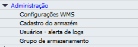
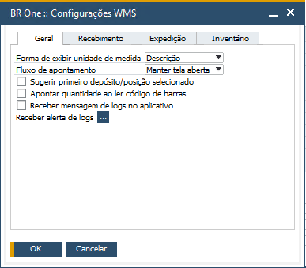
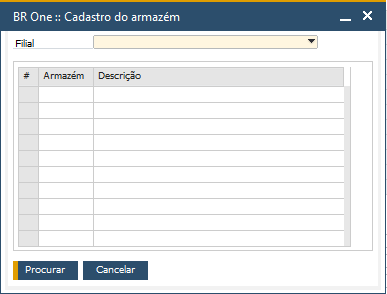
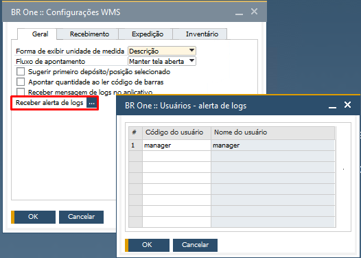

Administração
^^^^^^^^^^^^^^

| \

Na seção Administração, você encontrará todas as autorizações que adicionam comportamentos no SAP.

| \

Autorização Configurações WMS
~~~~~~~~~~~~~~~~~~~~~~~~~~~~~~~~~~~~~~~~~~~~~~~~~~~~~~~~

| \

Nesta autorização, caso seja definido "Sem autorização" o usuário não terá acesso a tela **BR One :: Configurações WMS**. Para permitir o acesso, defina a autorização como "Autorização total".

| \

Autorização Cadastro do armazém
~~~~~~~~~~~~~~~~~~~~~~~~~~~~~~~~~~~~~~~~~~~~~~~~~~~~~~~~

| \

Nesta autorização, caso seja definido "Sem autorização" o usuário não terá acesso a tela **BR One :: Cadastro do armazém**. Para permitir o acesso, defina a autorização como "Autorização total".

| \

Autorização Usuários - alerta de logs
~~~~~~~~~~~~~~~~~~~~~~~~~~~~~~~~~~~~~~~~~~~~~~~~~~~~~~~~

| \

Nesta autorização, caso seja definido "Sem autorização" o usuário não terá acesso a tela **BR One :: Usuários - alerta de logs**. Para permitir o acesso, defina a autorização como "Autorização total".

| \

Autorização Grupo de armazenamento
~~~~~~~~~~~~~~~~~~~~~~~~~~~~~~~~~~~~~~~~~~~~~~~~~~~~~~~~

.. image:: WMS-AutGrupoArmaz.png
   :align: center

| \

Nesta autorização, caso seja definido "Sem autorização" o usuário não terá acesso a tela **BR One :: Grupo de armazenamento**. Para permitir o acesso, defina a autorização como "Autorização total".