Aba Expedição
^^^^^^^^^^^^^^^^^

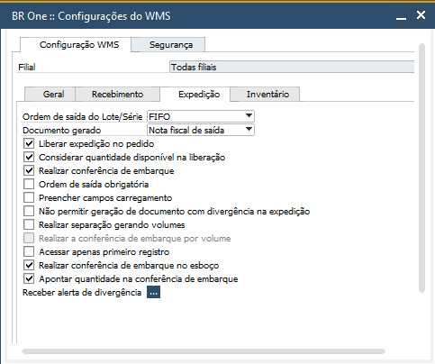

| \

Na Aba Expedição, você encontrará todos os parâmetros que adicionam comportamentos no módulo Expedição.

| \

Parâmetro Ordem de saída do Lote/Série
~~~~~~~~~~~~~~~~~~~~~~~~~~~~~~~~~~~~~~~~~~~~~~~~~~~~~~~~

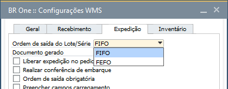

| \

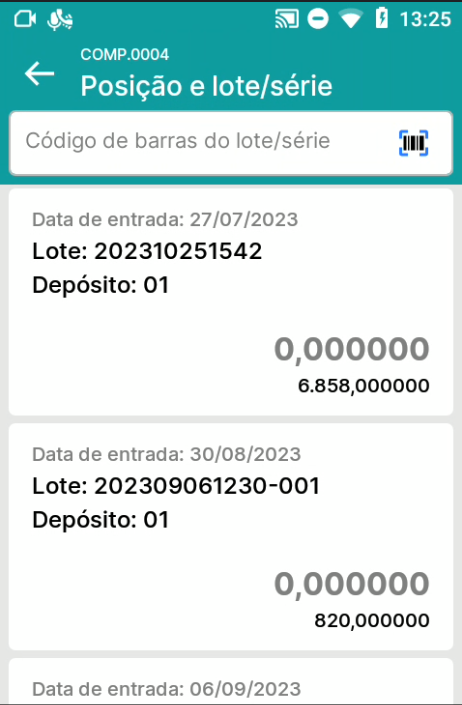

.. raw:: html

   

     
   

| \

O parâmetro **Ordem de saída do Lote/Série**, pode ser definido entre **FIFO e FEFO**.

No aplicativo, no menu Fila de separação, quando definido FIFO, para os itens controlados por lote/série, a ordem de exibição dos lotes será do lote/série que entrou primeiro até o último a entrar em estoque. No caso de FEFO, considerará da data de vencimento, exibindo os primeiros a vencer até os últimos a vencer.

| \

Parâmetro Documento gerado
~~~~~~~~~~~~~~~~~~~~~~~~~~~~~~~~~~~~~~~~~~~~~~~~~~~~~~~~

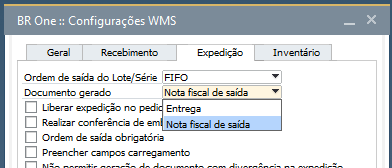

| \

O parâmetro **Documento gerado**, pode ser definido entre **Entrega ou Nota fiscal de saída**.

No aplicativo, no menu Fila de separação, quando concluir a separação de um Pedido de venda, o documento de destino será gerado de acordo com a opção selecionada: Entrega ou Nota fiscal de saída.

Quando definido como **Nota Fiscal de Saída**, na fila de separação serão exibidos os Esboços de Nota Fiscal de Saída, caso contrário serão exibidos apenas pedidos de venda e pedidos de devolução de mercadorias.

| \

Parâmetro Liberar expedição no pedido
~~~~~~~~~~~~~~~~~~~~~~~~~~~~~~~~~~~~~~~~~~~~~~~~~~~~~~~~

Quando o parâmetro **Liberar expedição no pedido** estiver desabilitado, todos os pedidos de venda e pedidos de devolução de mercadorias que forem criados no SAP, serão automaticamente exibidos no aplicativo, para que seja realizado o processo de separação.

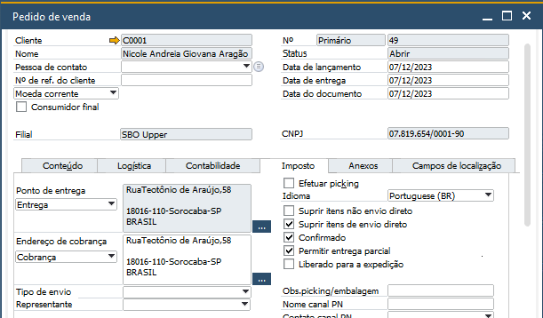

| \

Quando o parâmetro **Liberar expedição no pedido** estiver habilitado, será disponibilizado nos documentos de **Pedido de venda e Pedido de devolução de mercadorias**, na **aba logística**, o campo **Liberado para a expedição**. Os documentos que estiverem com esse campo desabilitado, não serão exibidos no aplicativo. Passarão a ser exibidos somente após o campo ser habilitado.

| \

Parâmetro Considerar quantidade disponível na liberação  
~~~~~~~~~~~~~~~~~~~~~~~~~~~~~~~~~~~~~~~~~~~~~~~~~~~~~~~~~~~~

Quando o parâmetro **Liberar expedição no pedido** estiver habilitado, o parâmetro **Considerar quantidade disponível na liberação** fica disponível para seleção e quanto ativo, a quantidade disponível dos itens do documento serão considerados na liberação.
			
Durante a criação de um pedido, é permitido adicionar qualquer quantidade de um determinado item, porém, no momento de marcar como liberado para expedição na aba logística, será feita a validação se existe quantidade para ser expedida, não havendo, será exibida uma mensagem de erro.

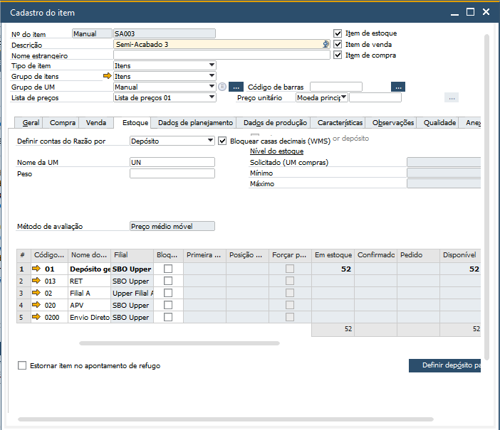

.. raw:: html

   

     
   

| \

Para o item acima, no estoque tem 52 unidades disponíveis. E no pedido abaixo estão sendo solicitadas 53 unidades para a venda.

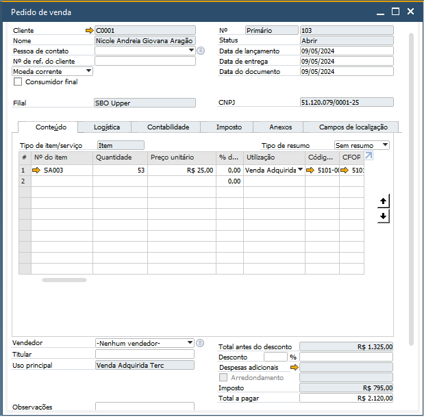

.. raw:: html

   

     
   

| \

O pedido é finalizado, mas não será listado no WMS.

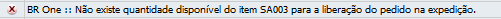

.. raw:: html

   

     
   

| \

Parâmetro Ordem de saída obrigatória
~~~~~~~~~~~~~~~~~~~~~~~~~~~~~~~~~~~~~~~~~~~~~~~~~~~~~~~~

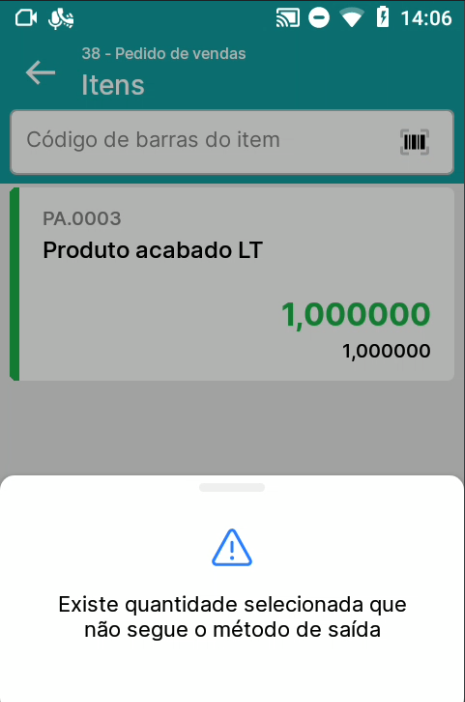

.. raw:: html

   

     
   

| \

No aplicativo, no menu Fila de separação, com o parâmetro **Ordem de saída obrigatória** marcado, caso o usuário selecione algum lote/série que não siga o método de saída definido (FIFO ou FEFO), o usuário será impedido de concluir a separação do documento.

| \

Parâmetro Preencher campos carregamento
~~~~~~~~~~~~~~~~~~~~~~~~~~~~~~~~~~~~~~~~~~~~~~~~~~~~~~~~

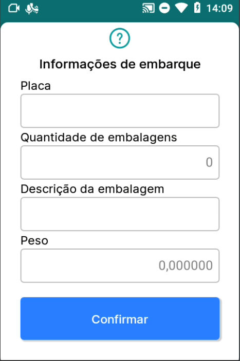

.. raw:: html

   

     
   

| \

No aplicativo, no menu Fila de separação, com o parâmetro **Preencher campos carregamento** marcado, no momento de concluir a separação do documento, será exibido um formulário, para que o usuário preencha as informações de embarque. Realizado o preenchimento e confirmado, essas informaações serão levadas para a aba Imposto do documento.

| \

Parâmetro Não permitir geração de documento com divergência na expedição
~~~~~~~~~~~~~~~~~~~~~~~~~~~~~~~~~~~~~~~~~~~~~~~~~~~~~~~~~~~~~~~~~~~~~~~~~

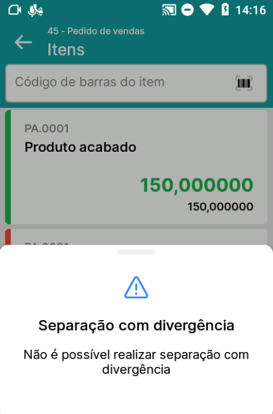

.. raw:: html

   

     
   

| \

No aplicativo, no menu Fila de separação, com o parâmetro **Não permitir geração de documento com divergência na expedição** marcado, no momento de concluir a separação do documento, caso exista alguma divergência na separação, o usuário será impedido de concluir.

| \

Parâmetro Realizar separação gerando volumes
~~~~~~~~~~~~~~~~~~~~~~~~~~~~~~~~~~~~~~~~~~~~~~~~~~~~~~~~~~~~~~~~~~~~~~~~~

.. |image-link6| image:: WMS-ParâmetroGerarVolumes.gif
   :width: 300px
   :align: middle

.. raw:: html

   

     
   

| \

No aplicativo, no menu Fila de separação, somente para Pedido de venda, com o parâmetro **Realizar separação gerando volumes** marcado, durante o processo de separação, é possível realizar a criação de pacotes. Conforme selecionadas as quantidades, no início do documento no canto superior direito, clicando no ícone de caixa, pode ser selecionada a opção de Fechar pacote. Após todos os pacotes terem sido criados, concluindo a separação dos itens, serão gerados os pacotes automaticamente.

| \

Parâmetro Realizar a conferência de embarque por volume
~~~~~~~~~~~~~~~~~~~~~~~~~~~~~~~~~~~~~~~~~~~~~~~~~~~~~~~~~~~~~~~~~~~~~~~~~

.. |image-link7| image:: WMS-ParâmetroConfEmbarqVolume.gif
   :width: 300px
   :align: middle

.. raw:: html

   

     
   

| \

No aplicativo, no menu Conferência de embarque, com o parâmetro **Realizar a conferência de embarque por volume** marcado, será necessário realizar a leitura do código do pacote e o serial da Nota fiscal de saída para realizar a conferência de embarque.

| \

Parâmetro Desconsiderar posição na fila de separação no Cadastro da posição no depósito
~~~~~~~~~~~~~~~~~~~~~~~~~~~~~~~~~~~~~~~~~~~~~~~~~~~~~~~~~~~~~~~~~~~~~~~~~~~~~~~~~~~~~~~~

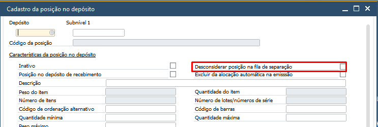

| \

Quando ativo o parâmetro **Desconsiderar posição na fila de separação** no Cadastro da posição no depósito, não será possível no aplicativo, no menu Fila de separação, selecionar quantidades de itens do da posição desconsiderada.

Parâmetro acessar apenas primeiro registro
~~~~~~~~~~~~~~~~~~~~~~~~~~~~~~~~~~~~~~~~~~~~~~

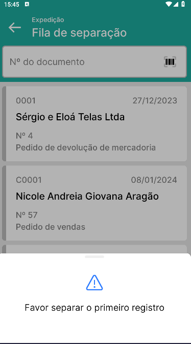

.. raw:: html

   

     
   

| \

Quando o parâmetro **Acessar apenas primeiro registro** estiver ativo, no aplicativo, ao acessar o menu **Fila de separação**, o usuário do WMS só poderá acessar o primeiro documento da fila. Logo, só será possível realizar a expedição de cada documento de acordo com a data de entrega do documento.

Parâmetro Conferência de embarque no esboço 
~~~~~~~~~~~~~~~~~~~~~~~~~~~~~~~~~~~~~~~~~~~~~~~~~~~~

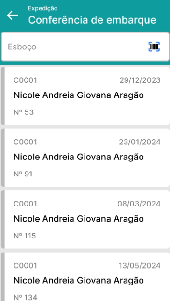

.. raw:: html

   

     
   

| \

Quando o parâmetro **Realizar conferência de embarque no esboço** estiver ativo, no aplicativo, ao acessar o menu Conferência de embarque, o usuário do WMS terá acesso a documentos de Esboço de nota fiscal de saída para realização da conferência de embarque.

| \

Esse parâmetro só fica disponível para ativação, caso o parâmetro **Realizar conferência de embarque** esteja ativo previamente. 

Parâmetro Apontar quantidade na conferência de embarque 
~~~~~~~~~~~~~~~~~~~~~~~~~~~~~~~~~~~~~~~~~~~~~~~~~~~~~~~~~~~~~~
 
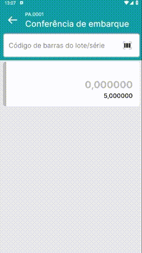

.. raw:: html

   

     
   

| \

Quando o parâmetro **Apontar quantidade na conferência de embarque** estiver ativo, no aplicativo, ao realizar a conferência de um determinado item, o usuário do WMS terá que digitar a quantidade.

| \

Esse parâmetro só fico disponível para ativação, caso o parâmetro **Realizar conferência de embarque** esteja ativo previamente.