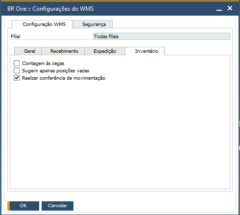
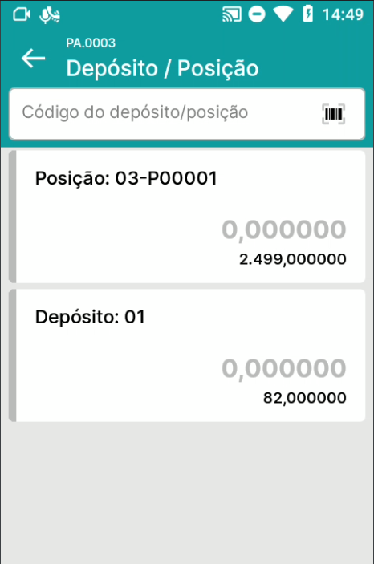
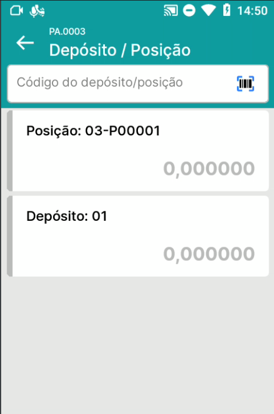
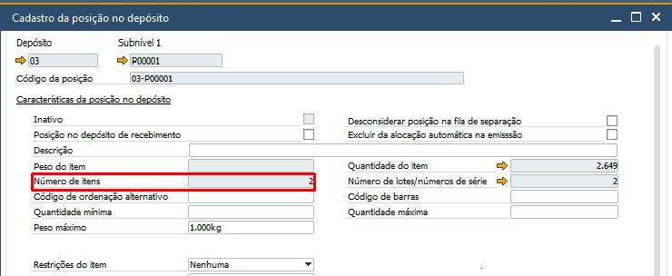
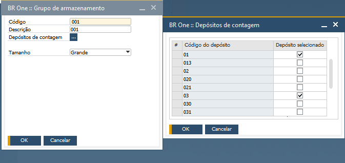

Aba Inventário
^^^^^^^^^^^^^^^^^

| \

Na Aba Inventário, você encontrará todos os parâmetros que adicionam comportamentos no módulo Inventário.

| \

Parâmetro Contagem às cegas
~~~~~~~~~~~~~~~~~~~~~~~~~~~~~~~~~~~~~~~~~~~~~~~~~~~~~~~~

.. raw:: html

   

     
   

| \

.. raw:: html

   

     
   

| \

No aplicativo, no menu Contagem de inventário, com o parâmetro **Contagem às cegas** desmarcado, na lista de depósitos/posições, será exibido para o usuário a quantidade esperada no documento e as sinalizações em verde e vermelho, que informam se atingiu a quantidade ou não do documento. Quando marcado, o usuário não terá a visibilidade da quantidade esperada no documento e nem as sinalizações.

| \

Parâmetro Sugerir apenas posições vazias
~~~~~~~~~~~~~~~~~~~~~~~~~~~~~~~~~~~~~~~~~~~~~~~~~~~~~~~~

| \

No processo de Sugestão de destino, quando o parâmetro **Sugerir apenas posições vazias** estiver marcado, todas as posições que possuem itens não serão consideradas. Serão consideradas apenas posições que não possuem itens.

| \

Parâmetro Depósitos de contagem em Grupo de armazenamento
~~~~~~~~~~~~~~~~~~~~~~~~~~~~~~~~~~~~~~~~~~~~~~~~~~~~~~~~~~~

| \

No cadastro do grupo de armazenamento, em **Depósitos de contagem** é possível definir os depósitos que serão considerados na abertura da Contagem por item. Neste exemplo, quando aberta uma contagem por item, serão abertas linhas para contagem nos depósitos 01 e 03. No caso do depósito 03 por ser controlado por posições, todas as posições deste depósito também terão contagem aberta.

