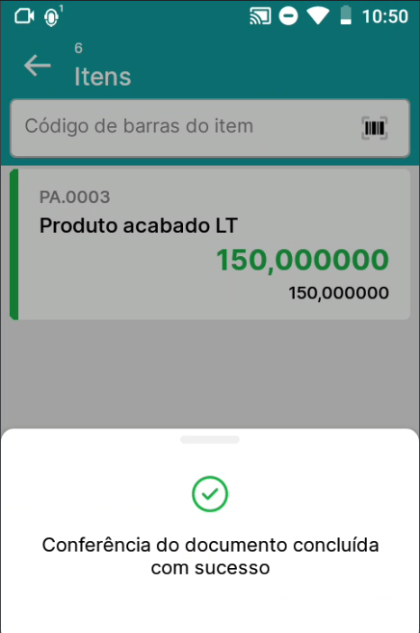
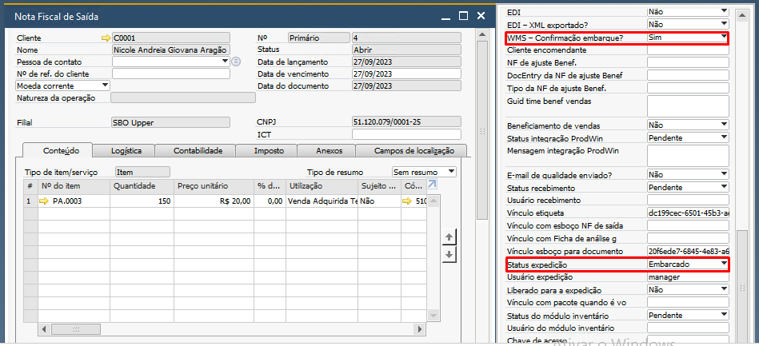

Conferência de embarque
^^^^^^^^^^^^^^^^^^^^^^^^^
.. |image-link| image:: WMS-AcessoConferênciaEmbarque.gif
   :width: 300px
   :align: middle

.. raw:: html

   

     
   

| \

Ao acessar o menu Conferência de embarque, todas as Notas Fiscais de Saída criadas no SAP serão listadas.

| \

.. |image-link2| image:: WMS-AcessandoDocConferênciaEmbarq.gif
   :width: 300px
   :align: middle

.. raw:: html

   

     
   

| \

Você pode acessar os documentos listados selecionando manualmente, realizando a leitura via código de barras do serial do documento ou digitando o serial no campo de pesquisa.

| \

.. |image-link3| image:: WMS-SeleçãodeitemConfEmbarq.gif
   :width: 300px
   :align: middle

.. raw:: html

   

     
   

| \

Após acessar o documento, os itens serão listados. Selecione o item manualmente ou bipando o código do item/código de barras.

| \

.. |image-link4| image:: WMS-LeituraConfEmbarq.gif
   :width: 300px
   :align: middle

.. raw:: html

   

     
   

| \

Uma vez selecionado o item, serão exibidos todos os lotes/séries definidos no documento. Faça a conferência manualmente ou bipando via código de barras o lote/série.

| \

.. raw:: html

   

     
   

| \

| \

Concluindo a conferência de embarque no aplicativo, na Nota Fiscal de Saída, os campos 'WMS – Confirmação embarque?' e 'Status expedição' serão alterados para 'Sim' e 'Embarcado' respectivamente.

| \

.. important::

   A conclusão da conferência de embarque será concluída somente após a confirmação de todos os itens e lotes/séries; caso contrário, não será possível finalizar a conferência de embarque até que todos lotes/séries sejam confirmados.

| \

.. note::

   Configurações do WMS quando ativas, podem adicionar comportamentos no menu Conferência de embarque, clique **aqui** e saiba mais sobre as configurações.