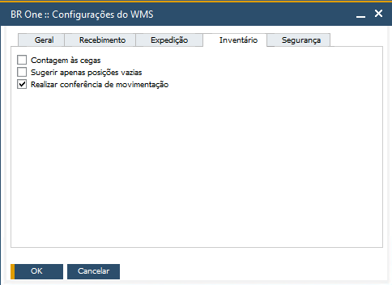

Conferência de movimentação
^^^^^^^^^^^^^^^^^^^^^^^^^^^

   
| \

Quando o parâmetro **Realizar conferência de movimentação** estiver ativo, todas as transferências de estoque realizadas pelo menu **Inventário > Transferir de estoque > Nova Transferência** serão exibidas no menu **Conferência de movimentação**.

Essa transferência, primeiramente será alocada para um deposito em transito que pode ser configurado em:

* **Base multifilial habilitada**: o cadastro do depósito em Transito é feito no SAP em **Administração > Definição > Finanças > Filiais > Campo "Depósito em trânsito - WMS"**.

.. image:: WMS-ConfDepositoEmTransito.png
   :align: center
   
| \

* **Base multifilial desabilitada**: o cadastro do depósito em Transito é feito no SAP em **Administração > Definição > BR One WMS > Configurações do WMS**.

 **imagem da base multifilial desabilitada**

 Essa transferência alocada no deposito em transito, será conferida no menu Conferência  de movimentação. Assim que a mesma for conferida, será feita a  transferência de estoque para o depósito destino.

.. |image-link3| image:: WMS-AcessoConferênciaMovimentação.gif
   :width: 300px
   :align: middle

.. raw:: html

   

     
   

| \

.. important::

   Para que o deposito seja definido como um **Depósito em transito - WMS**, ele precisa cumprir alguns requisitos, sendo eles: 

   * Se a base tem licença de BR One Produção, no cadastro do deposito, os campos **Conta entrega** e **Conta saída** devem estar preenchidos. E o campo **Expedição direta** deve estar desmarcado.

   * Se a base não tem a licença BR One Produção, no cadastro do deposito, o campo **Expedição direta** deve estar desmarcado.

| \
