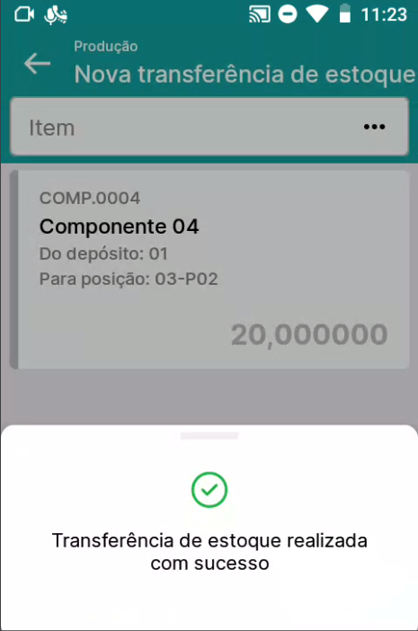
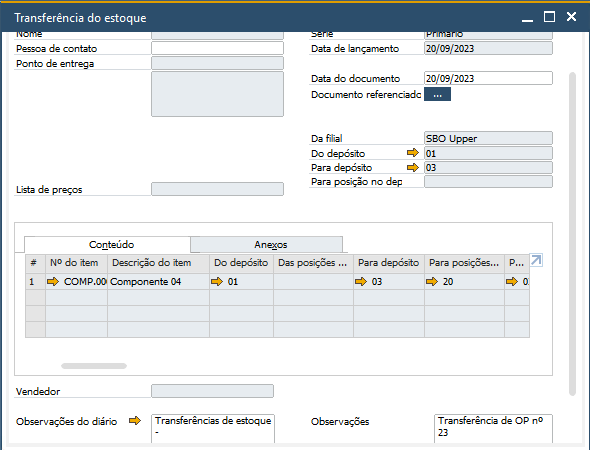

Transferir para produção
^^^^^^^^^^^^^^^^^^^^^^^^^

.. note::

   O menu Transferir para produção estará visível apenas para as bases de dados que possuam licença BR One Produção.

| \

.. |image-link| image:: WMS-AcessandoMenuTransferirProd.gif
   :width: 300px
   :align: middle

.. raw:: html

   

     
   

| \

No menu Transferir para produção, serão listadas todas as OPs que tenham seu status definido como **Liberada**. Acesse a OP escolhendo manualmente, digitando o código do documento ou realizando a leitura via código de barras.

| \

.. |image-link2| image:: WMS-ListadePedidosdeTransf.gif
   :width: 300px
   :align: middle

.. raw:: html

   

     
   

| \

Escolhida uma OP, será exibida no aplicativo uma lista de pedidos de transferência de estoque vinculados a ordem de produção (OP) selecionada. A lista exibe o número do pedido e a data de solicitação. Selecione o pedido escolhendo manualmente, digitando o código do documento ou realizando a leitura via código de barras.

Se não houver nenhum pedido de transferência vinculado à OP selecionada, uma mensagem é exibida notificando o usuário.

| \

.. tip::

   Saiba mais sobre a criação de pedidos de transferência para a OP, clicando **aqui**.

| \

.. |image-link3| image:: WMS-PedidoBaseTransfAvulsa.gif
   :width: 300px
   :align: middle

.. raw:: html

   

     
   

| \

Ao acessar um pedido de transferência existente, os itens definidos no documento serão listados. Também é possível iniciar uma transferência para produção sem utilizar um pedido de transferência, clicando no botão + no canto inferior direito.

| \

.. |image-link4| image:: WMS-ListagemdeComponentes.gif
   :width: 300px
   :align: middle

.. raw:: html

   

     
   

| \

Para inserir itens em uma transferência para produção, você pode fazer isso por meio da leitura do código de barras do item ou da seleção na listagem dos componentes da ordem de produção. Apenas itens que pertençam à ordem de produção escolhida podem ser inseridos.

| \

.. |image-link5| image:: WMS-PreenchimentodaTransferência.gif
   :width: 300px
   :align: middle

.. raw:: html

   

     
   

| \

Após selecionar o item, as disponibilidades do item nos depósitos serão listadas. Escolha o lote/série da posição desejada e preencha a quantidade e o depósito/posição de destino.

| \

.. raw:: html

   

     
   

| \

| \

Concluída a transferência para produção no aplicativo, o documento Transferência do estoque será gerado no SAP, com o campo Observações referenciando o número da ordem de produção que originou a transferência.

| \

.. hint::

   Parâmetro do BR One WMS, localizado na aba Geral das Configurações WMS, quando ativo, pode realizar comportamento adicional durante o processo. Confira o comportamento do parâmetro clicando **aqui**.

| \