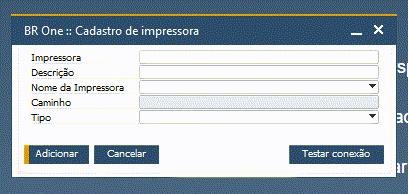

Impressão de etiquetas
^^^^^^^^^^^^^^^^^^^^^^^^

Em todos os menus do BR One WMS, conforme as configurações para impressão de etiquetas definidas, nas conclusões dos processos as etiquetas serão impressas.

| \

.. image:: WMS-ConfURLAPI.png
   :align: center

| \

Em **Módulos > Administração > Inicialização do sistema > Configurações gerais**, na aba Impressão, insira a URL da API. Para confirmar se a conexão com a API está ok, clique no botão "Realizar teste de conexão".

.. note::

   Caso a conexão com a API não esteja ok, certifique-se de que o endereço informado está correto e revise as configurações de instalação da API.

| \

| \

.. image:: WMS-BROneAdm2.png
   :align: center

| \

Em **Ajuda > Support Desk > BR One > Modo de administração**, insira a URL da Service Layer, na opção **Configurar URL da Service Layer**.

| \

| \

| \

Acessando **Módulos > BR One > Configurações de impressão > Cadastro de impressora**, através da URL configurada anteriormente, a API fará uma busca de todas as impressoras que estão disponíveis no ambiente.

Finalizada a consulta das impressoras, no modo de adição de documentos, faça o cadastro das impressoras que serão utilizadas nos processos de impressão de etiquetas.

| \

.. image:: WMS-ImpProcessoLista.png
   :align: center

| \

.. image:: WMS-ImpProcCadastro.png
   :align: center

| \

Acessando **Módulos > BR One > Configurações de impressão > Impressão por processo**, é possível visualizar todos os processos que podem ter configurada a impressão de etiquetas.

No cabeçalho selecione o processo que receberá a configuração da impressão de etiquetas.

Em "Consulta", defina o nome da procedure utilizada no processo. Verifique no botão "Template", um modelo de procedure.

Escolha o "Armazém" que ficará vinculado ao processo de impressão de etiquetas.

No grid, escolha a impressora e adicione a configuração. Sendo marcada como padrão, após a conclusão do processo no aplicativo, essa será a impressora escolhida automaticamente, caso contrário, o usuário terá que selecionar manualmente no aplicativo.

Na seta laranja, será aberta a tela para inserção do layout. Em "Opções", selecione Exportar para o servidor e escolha o arquivo do layout. Sendo marcado como padrão, após a conclusão do processo no aplicativo, esse será o layout escolhido automaticamente, caso contrário, o usuário terá que selecionar manualmente no aplicativo.

| \

.. tip::

   Todo processo concluído no BR One WMS, é registrado nas tabelas "@UPW_OETI" e "@UPW_ETI1". Essas tabelas terão que ser utilizadas na construção da procedure, para que seja possível resgatar as informações necessárias na elaboração do layout da etiqueta.