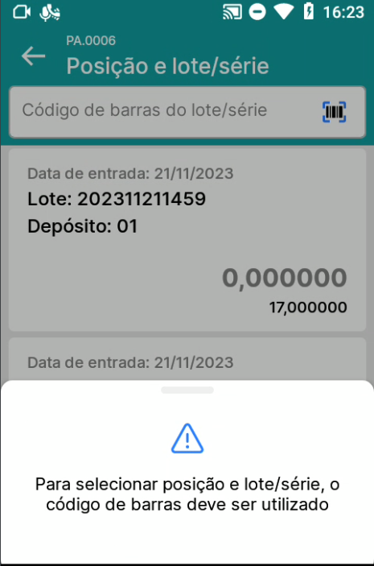
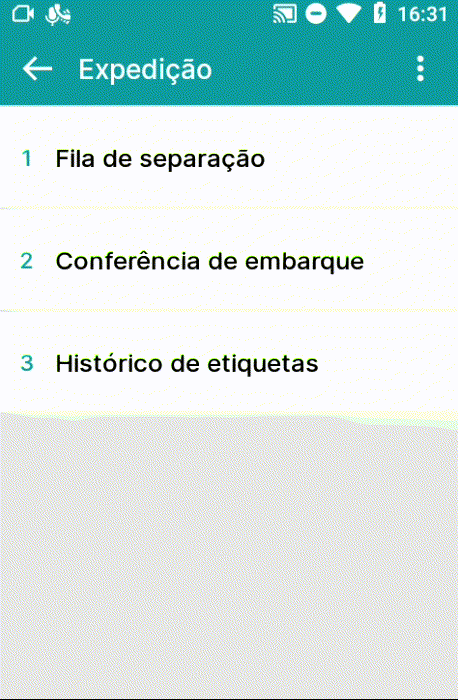
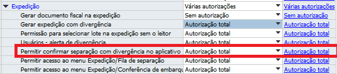

Expedição
^^^^^^^^^^

.. image:: WMS-Exped.png
   :align: center

| \

Na seção Expedição, você encontrará todas as autorizações que adicionam comportamentos no módulo Expedição e no SAP.

| \

Autorização Gerar documento fiscal na expedição
~~~~~~~~~~~~~~~~~~~~~~~~~~~~~~~~~~~~~~~~~~~~~~~~~~~~~~~~

Definindo "Sem autorização" em **Gerar documento fiscal na expedição**, o usuário não poderá gerar documentos definitivos ao concluir as separações no menu Fila de separação. Com "Autorização total", o usuário passará a gerar documentos definitivos.

| \

Autorização Gerar expedição com divergência
~~~~~~~~~~~~~~~~~~~~~~~~~~~~~~~~~~~~~~~~~~~~~~~~~~~~~~~~

Definindo "Sem autorização" em **Gerar expedição com divergência**, o usuário não poderá gerar documentos definitivos ao concluir as separações quando elas tenham divergência, no menu Fila de separação. Com "Autorização total", o usuário passará a gerar documentos definitivos, mesmo que possuam divergências.

| \

Autorização Permissão para selecionar lote na expedição sem o leitor
~~~~~~~~~~~~~~~~~~~~~~~~~~~~~~~~~~~~~~~~~~~~~~~~~~~~~~~~~~~~~~~~~~~~~~

.. raw:: html

   

     
   

| \

Na Fila de separação, quando "Sem autorização" em **Permissão para selecionar lote na expedição sem o leitor**, para itens que são controlados por lote/série, no momento de selecionar o lote/série, não será permitido que o usuário selecione manualmente, será exigida a leitura do lote/série. Com "Autorização total", será possível selecionar o lote/série manualmente.

| \

Autorizações Permitir acesso ao menu
~~~~~~~~~~~~~~~~~~~~~~~~~~~~~~~~~~~~~~~~~~~~~~~~~~~~~~~~

.. raw:: html

   

     
   

| \

Nas autorizações **Permitir acesso ao menu Expedição/Fila de separação e Permitir acesso ao menu Expedição/Conferência de embarque**, se estiver definido "Sem autorização", não será permitido que o usuário acesse os menus. Pode ser dada "Autorização total" nos menus que o usuário terá acesso permitdo.

Autorização Permitir confirmar separação com divergência no aplicativo 
~~~~~~~~~~~~~~~~~~~~~~~~~~~~~~~~~~~~~~~~~~~~~~~~~~~~~~~~~~~~~~~~~~~~~~~~~~~~~~

.. raw:: html

   

     
   

| \

Definindo "Sem autorização" em Permitir confirmar separação com divergência no aplicativo, o usuário não poderá concluir as separações quando elas tem divergência na contagem dos itens. Com "Autorização total", o usuário passará a concluir as separações, mesmo que possuam divergências. 

.. important::

  Essa autorização de usuário sobressai a configuração definida na aba Expedição!

| \