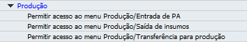

Produção
^^^^^^^^^^

| \

Na seção Produção, você encontrará todas as autorizações que adicionam comportamentos no módulo Produção.

| \

Autorizações Permitir acesso ao menu
~~~~~~~~~~~~~~~~~~~~~~~~~~~~~~~~~~~~~~~~~~~~~~~~~~~~~~~~

.. |image-link| image:: WMS-AutorizaçãoPermitirAcesso.gif
   :width: 300px
   :align: middle

.. raw:: html

   

     
   

| \

Nas autorizações **Permitir acesso ao menu Produção/Entrada de PA, Permitir acesso ao menu Produção/Saída de insumos e Permitir acesso ao menu Produção/Transferência para produção**, se estiver definido "Sem autorização", não será permitido que o usuário acesse os menus. Pode ser dada "Autorização total" nos menus que o usuário terá acesso permitdo.