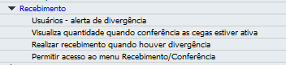
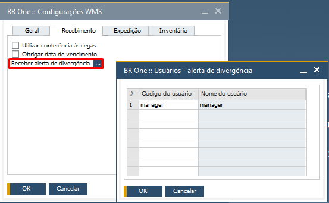
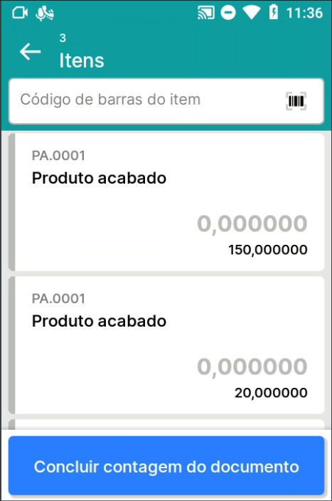
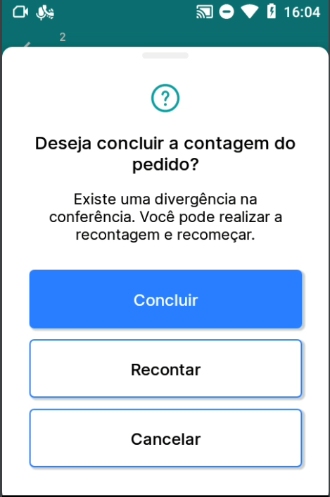
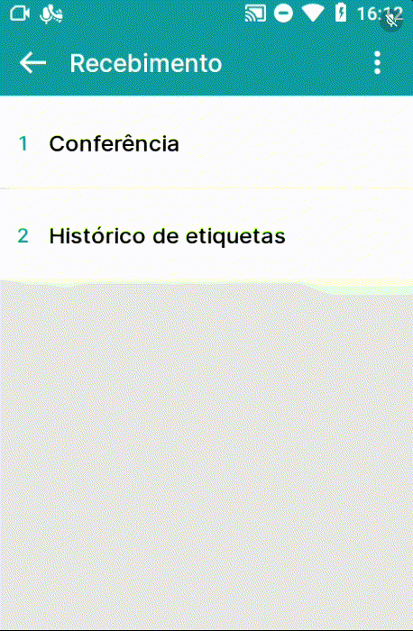

Recebimento
^^^^^^^^^^^^

| \

Na seção Recebimento, você encontrará todas as autorizações que adicionam comportamentos no módulo Recebimento e no SAP.

| \

Autorização Usuários - alerta de divergência
~~~~~~~~~~~~~~~~~~~~~~~~~~~~~~~~~~~~~~~~~~~~~~~~~~~~~~~~

| \

Nesta autorização, caso seja definido "Sem autorização" o usuário não terá acesso a tela **BR One :: Usuários - alerta de divergência** da aba Recebimento. Para permitir o acesso, defina a autorização como "Autorização total".

| \

Autorização Visualiza quantidade quando conferência as cegas estiver ativa
~~~~~~~~~~~~~~~~~~~~~~~~~~~~~~~~~~~~~~~~~~~~~~~~~~~~~~~~~~~~~~~~~~~~~~~~~~~~

.. raw:: html

   

     
   

| \

Quando nas Configurações WMS, na aba Recebimento, o parâmetro **Utilizar conferência às cegas** estiver ativo, definindo a autorização **Visualiza quantidade quando conferência as cegas estiver ativa** como "Autorização total", o usuário conseguirá visualizar as quantidades do documento.

| \

Autorização Realizar recebimento quando houver divergência
~~~~~~~~~~~~~~~~~~~~~~~~~~~~~~~~~~~~~~~~~~~~~~~~~~~~~~~~~~~~~~~~~~~~~~~~~~~~

.. raw:: html

   

     
   

| \

No menu Conferência, caso o usuário conclua uma conferência com divergência, possuindo "Autorização total", o documento de destino será gerado definitivo no SAP. Sendo "Sem autorização", o usuário concluindo com divergência, o documento de destino será gerado como esboço.

| \

Autorização Permitir acesso ao menu
~~~~~~~~~~~~~~~~~~~~~~~~~~~~~~~~~~~~~~~~~~~~~~~~~~~~~~~~~~~~~~~~~~~~~~~~~~~~

.. raw:: html

   

     
   

| \

Na autorização **Permitir acesso ao menu Recebimento/Conferência**, se estiver definido "Sem autorização", não será permitido que o usuário acesse o menu. Pode ser dada "Autorização total" no menu que o usuário terá acesso permitdo.