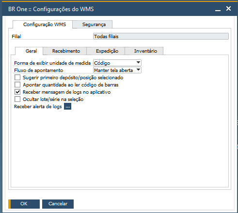
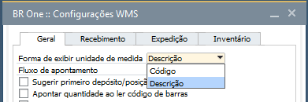
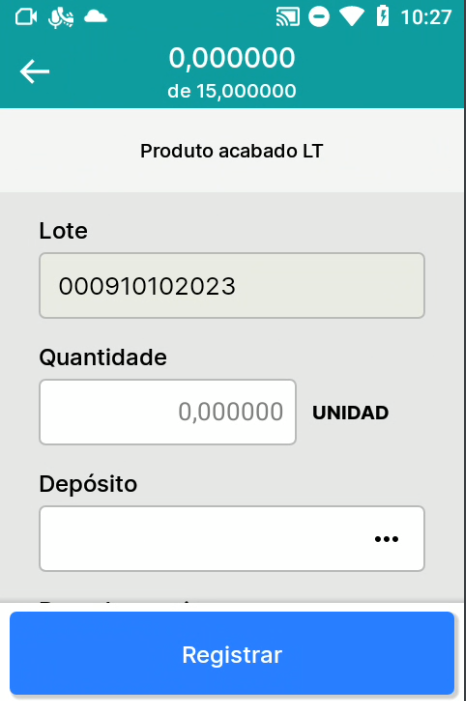
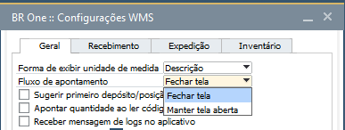
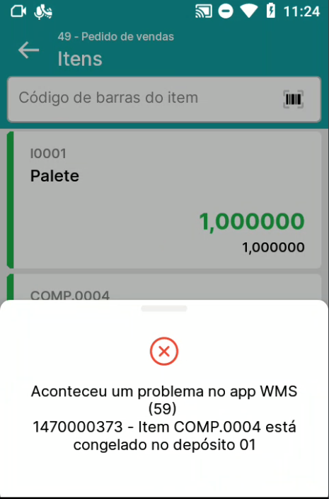
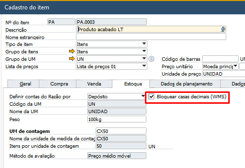
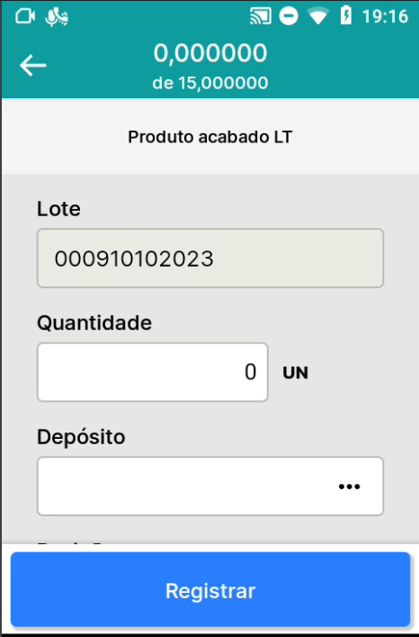
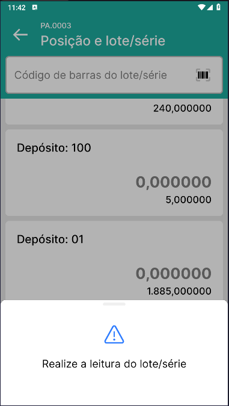

Aba Geral
^^^^^^^^^^

| \

Na Aba Geral, você encontrará todos os parâmetros que adicionam comportamentos em diversos menus do aplicativo.

| \

Parâmetro Forma de exibir unidade de medida
~~~~~~~~~~~~~~~~~~~~~~~~~~~~~~~~~~~~~~~~~~~~~~~~~~~~~~~~

| \

.. raw:: html

   

     
   

| \

O parâmetro **Forma de exibir unidade de medida**, pode ser definido entre **Descrição e Código**.

No aplicativo, em todos os menus, de acordo com a opção selecionada, nos detalhes do item, do lado do campo Quantidade, será exibida a descrição ou o código da unidade de medida.

| \

Parâmetro Fluxo de apontamento
~~~~~~~~~~~~~~~~~~~~~~~~~~~~~~~~~~~~~~~~~~~~~~~~~~~~~~~~

| \

.. |image-link2| image:: WMS-ParâmetroFlxApont.gif
   :width: 300px
   :align: middle

.. raw:: html

   

     
   

| \

O parâmetro **Fluxo de apontamento**, pode ser definido entre **Fechar tela e Manter tela aberta**.

No aplicativo, nos menus Conferência e Contagem de inventário, com a opção Fechar tela selecionada, após registrar o apontamento será retornada para a tela anterior. Definida a opção Manter a tela aberta, após registrar o apontamento a tela será mantida.

| \

Parâmetro Sugerir primeiro depósito/posição selecionado
~~~~~~~~~~~~~~~~~~~~~~~~~~~~~~~~~~~~~~~~~~~~~~~~~~~~~~~~

.. |image-link3| image:: WMS-ParâmetroSugerirPrimeiraPosição.gif
   :width: 300px
   :align: middle

.. raw:: html

   

     
   

| \

Quando ativo o parâmetro **Sugerir primeiro depósito/posição selecionado**, no aplicativo, nos menus Transferir para produção e Transferir estoque, após registrar o primeiro depósito/posição, os próximos lançamentos virão pré-preenchidos com o primeiro depósito/posição selecionado.

| \

Parâmetro Apontar quantidade ao ler código de barras
~~~~~~~~~~~~~~~~~~~~~~~~~~~~~~~~~~~~~~~~~~~~~~~~~~~~~~~~

.. |image-link4| image:: WMS-ParâmetroApontCódBarras.gif
   :width: 300px
   :align: middle

.. raw:: html

   

     
   

| \

Quando ativo o parâmetro **Apontar quantidade ao ler código de barras**, no aplicativo, em todos os menus, será realizado o preenchimento da quantidade através da leitura do código do item ou código de barras.

| \

Parâmetro Receber mensagem de logs no aplicativo
~~~~~~~~~~~~~~~~~~~~~~~~~~~~~~~~~~~~~~~~~~~~~~~~~~

.. raw:: html

   

     
   

| \

Quando ativo o parâmetro **Receber mensagem de logs no aplicativo**, em todos os menus, todas as mensagens de erros que seriam exibidas apenas para os usuários definidos em **Receber alerta de logs**, passam a ser exibidas no aplicativo.

Parâmetro Bloquear casas decimais (WMS) no Cadastro do item
~~~~~~~~~~~~~~~~~~~~~~~~~~~~~~~~~~~~~~~~~~~~~~~~~~~~~~~~~~~~~

| \

.. raw:: html

   

     
   

| \

No Cadastro do item, na aba Estoque, quando ativo o parâmetro **Bloquear casas decimais (WMS)**, em todos os menus, as casas decimais serão removidas na digitação da quantidade.

Parâmetro Ocultar Lote/Seleção
~~~~~~~~~~~~~~~~~~~~~~~~~~~~~~~~~~

.. raw:: html

   

     
   

| \

- Quando o parâmetro **Ocultar lote/seleção** estiver ativo, no aplicativo, o usuário não terá mais a visão do lote/série e a seleção só estará disponível através da leitura do código de barras do lote/série. 