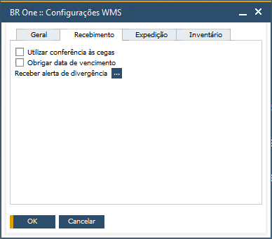
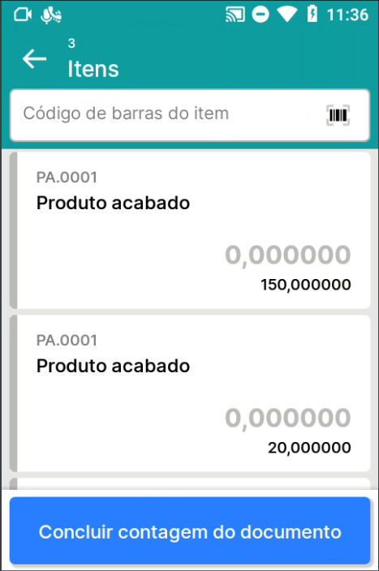
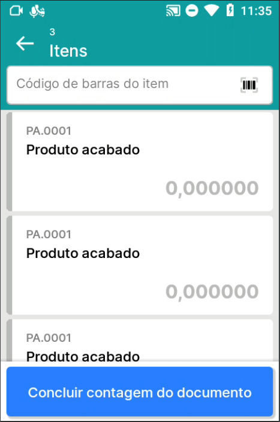
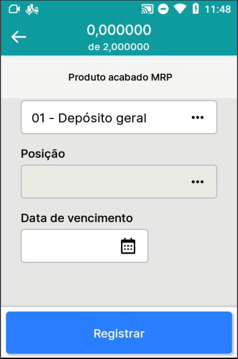

Aba Recebimento
^^^^^^^^^^^^^^^^^

| \

Na Aba Recebimento, você encontrará todos os parâmetros que adicionam comportamentos no módulo Recebimento.

| \

Parâmetro Utilizar conferência às cegas
~~~~~~~~~~~~~~~~~~~~~~~~~~~~~~~~~~~~~~~~~~~~~~~~~~~~~~~~

.. raw:: html

   

     
   

| \

.. raw:: html

   

     
   

| \

No aplicativo, no menu Conferência, com o parâmetro **Utilizar conferência às cegas** desmarcado, na lista de itens, será exibido para o usuário a quantidade esperada no documento e as sinalizações em verde e vermelho, que informam se atingiu a quantidade ou não do documento. Quando marcado, o usuário não terá a visibilidade da quantidade esperada no documento e nem as sinalizações.

| \

Parâmetro Obrigar data de vencimento
~~~~~~~~~~~~~~~~~~~~~~~~~~~~~~~~~~~~~~~~~~~~~~~~~~~~~~~~

.. raw:: html

   

     
   

| \

No aplicativo, no menu Conferência, com o parâmetro **Obrigar data de vencimento** marcado, não vai permitir que o usuário concluda a conferência do documento, sem informar data de vencimento para itens controlados por lote/série.
