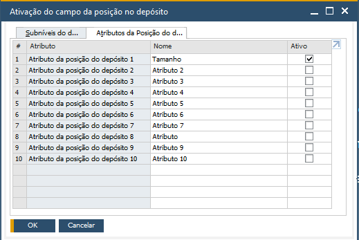
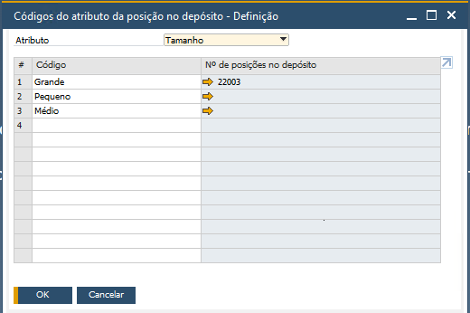
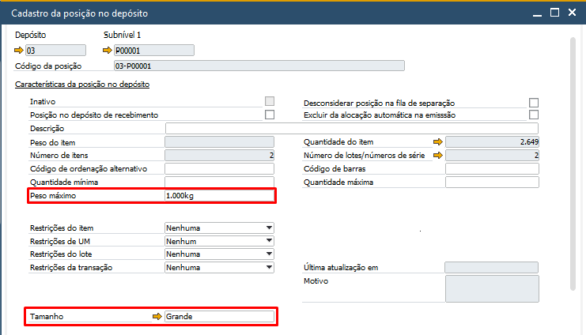
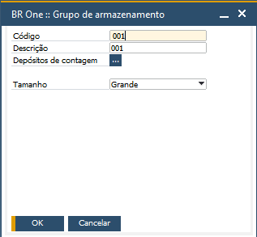
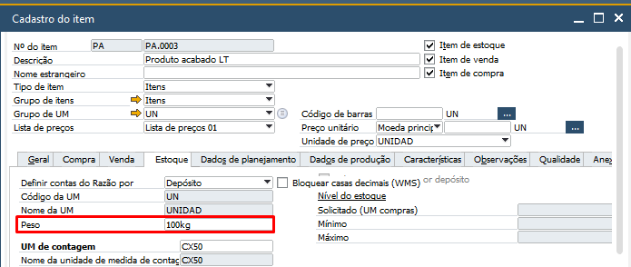
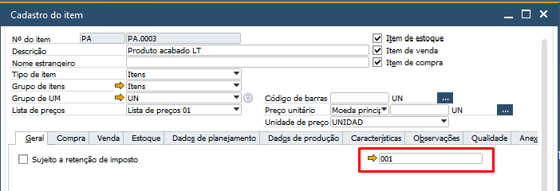

Sugestão de destino
^^^^^^^^^^^^^^^^^^^^

Aplicadas as configurações de Sugestão de destino, poderá ser utilizada no módulo Inventário, nos menus Pedir transferência de estoque e Transferir estoque.

| \

Configurando sugestão de destino
~~~~~~~~~~~~~~~~~~~~~~~~~~~~~~~~~~

| \

Em **Módulos > Definição > Estoque > Posições no depósito > Ativação do campo da posição no depósito**, na aba Atributos da posição do depósito, ative até 10 atributos na posição. Neste exemplo, ativado apenas um atributo e renomeado para "Tamanho".

| \

| \

Em **Módulos > Definição > Estoque > Posições no depósito > Códigos do atributo da posição no depósito**, no cabeçalho selecione o atributo, defina códigos para o atributo. Neste exemplo, para o atributo "Tamanho", criados os códigos "Grande", "Pequeno" e "Médio".

| \

| \

Em **Módulos > Estoque > Cadastro da posição no depósito**, defina o peso máximo da posição e um código no atributo. Neste exemplo, definido o peso máximo 1.000kg e no atributo, o código "Grande".

| \

| \

Em **Módulos > Definição > BR One WMS > Grupo de armazenamento**, crie um grupo, informando o código, descrição. Todos os atributos ativos nas posições, também serão ativos nesta tela. Defina nos atributos ativos os códigos que serão correspondentes as posições desejadas. Neste exemplo, definido o atributo como "Grande".

| \

| \

| \

Em **Módulos > Estoque > Cadastro do item**, na aba Geral, no campo Grupo de armazenamento, insira o Grupo de armazenamento que possui as correspondências nas posições, ideais para o armazenamento do item. 

Na aba Estoque, defina o peso do item.

Neste exemplo, inserido o Grupo de armazenamento criado anteriormente e definido o peso do item em 100kg.

| \

Sugestão de destino na prática
~~~~~~~~~~~~~~~~~~~~~~~~~~~~~~~~~~

.. |image-link| image:: WMS-SugestãoPrática.gif
   :width: 300px
   :align: middle

.. raw:: html

   

     
   

| \

No vídeo a cima, no menu Transferir estoque, após selecionar o item, no momento de realizar o preenchimento da quantidade, foi realizada a sugestão de destino.

Neste exemplo, o item possui um peso de 100kg, foram digitadas primeiramente 5 quantidades, totalizando 500kg.

O grupo de armazenamento possui o atributo Tamanho = Grande. No momento que é selecionado o item, é realizada uma consulta, pesquisando nos cadastros de posição, todas as posições que possuem o atributo Tamanho = Grande.

Como o total inicial digitado eram 5 quantidades totalizando 500kg, dentre as posições que possuem a correspondência exata com o grupo de armazenamento, será feita a validação de peso disponível.

As posições possuem um peso máximo de 1.000kg, e de acordo com o peso já inserido na posição, ocorre o cálculo: peso máximo - peso utilizado = peso disponível.

Considerando o peso disponível das posições que possuem os atributos correspondentes, será escolhida a primeira posição que ainda possui peso disponível para 500kg. Neste exemplo foi preenchida a posição 03-P00002.

Porém, quando aumentada a quantidade de 5 para 50, totalizando 5.000kg, a sugestão limpou o depósito/posição, pois nenhuma das posições possuía peso disponível para suportar 5.000kg.