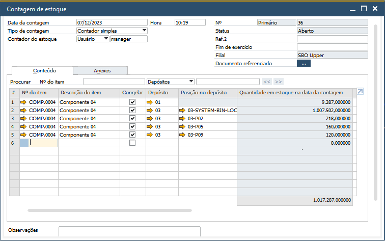
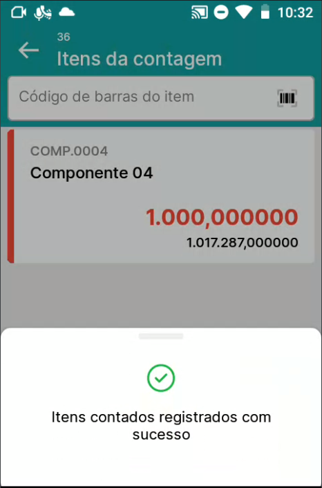

Contagem de inventário
^^^^^^^^^^^^^^^^^^^^^^^^

.. |image-link| image:: WMS-AcessandoContagemInventário.gif
   :width: 300px
   :align: middle

.. raw:: html

   

     
   

| \

Acessando o menu Contagem de inventário, serão listadas todas as contagens de estoque criadas. Selecione a contagem de estoque manualmente via tela ou via leitura de código de barras do número do documento/código do item.

| \

.. |image-link2| image:: WMS-ApontandoContagemExistente.gif
   :width: 300px
   :align: middle

.. raw:: html

   

     
   

| \

Existindo uma contagem listada, você pode clicar no ícone "i", para exibir os itens que estão inseridos na contagem de estoque.

Abrindo a contagem de estoque, será listado primeiramente, os itens inseridos na contagem. Selecione o item através da leitura via código de barras ou selecionando manualmente.

Após selecionar o item, serão listados os depósitos/posições para contagem. Selecione o depósito/posição através da leitura via código de barras ou selecionando manualmente.

Nos detalhes do item, faça o preenchimento do lote/série caso o item possua controle por lote/série, informe a quantidade e registe o apontamento.

| \

.. raw:: html

   

     
   

| \

.. image:: WMS-ContagemExistenteSAP.png
   :align: center

| \

Neste exemplo, para o item PA.0003, foi registrada uma contagem de 500 quantidades no depósito/posição 03-P00001. Concluindo a contagem de estoque no aplicativo, será atualizado no SAP o documento de acordo com o apontamento realizado, marcando a linha como "Contado". Caso acessada a contagem de estoque novamente no aplicativo, para o item PA.0003 o depósito/posição 03-P00001 não será mais exibido.

| \

.. |image-link4| image:: WMS-OpçõesContagens.gif
   :width: 300px
   :align: middle

.. raw:: html

   

     
   

| \

Para realizar uma abertura de contagem de estoque, é possível através do botão **"+"** localizado no canto inferior direito, selecionar entre **Contagem avulsa** ou **Contagem por item**

| \

Contagem avulsa
----------------

Para cenários que é necessária apenas uma contagem pontual em depósitos/posições específicos, a contagem avulsa auxiliará nesse processo.

| \

.. |image-link5| image:: WMS-ApontamentoContAvulsa.gif
   :width: 300px
   :align: middle

.. raw:: html

   

     
   

| \

Selecionando a opção Contagem avulsa, será aberto um modal para que seja informado o código do item e posteriormente o depósito/posição.

Nos detalhes do item, faça o preenchimento do lote/série caso o item possua controle por lote/série, informe a quantidade e registe o apontamento.

| \

.. |image-link6| image:: WMS-ConcluindoContAvulsa.png
   :width: 300px
   :align: middle

.. raw:: html

   

     
   

| \

| \

Neste exemplo, para o item PA.0004, foi registrada uma contagem de 1 quantidade no depósito/posição 03-P00531. Concluindo a contagem de estoque no aplicativo, será gerado no SAP o documento Contagem de estoque com o apontamento realizado, marcando a linha como "Contado".

| \

Contagem por item
-------------------

Para cenários que é necessária uma contagem em massa dos depósitos/posições, a contagem por item auxiliará nesse processo.

| \

.. |image-link7| image:: WMS-ApontamentoContItem.gif
   :width: 300px
   :align: middle

.. raw:: html

   

     
   

| \

| \

Selecionando a opção Contagem por item, será exibida a  lista de itens, para que seja selecionado o item através da leitura via código de barras ou manualmente.

Após selecionar o item, será aberto no SAP uma contagem de estoque para todo depósito/posição que o item possua quantidade.

.. important::

   Caso o item possua grupo de armazenamento definido no Cadastro do item, o grupo de armazenamento possuindo depósitos selecionados, no momento de abrir a contagem por item, serão abertos apenas os depósitos selecionados. Saiba mais sobre o grupo de armazenamento clicando **aqui**.

Nos detalhes do item, faça o preenchimento do lote/série caso o item possua controle por lote/série, informe a quantidade e registe o apontamento.

| \

.. raw:: html

   

     
   

| \

| \

Neste exemplo, para o item COMP.0004, foi registrada uma contagem de 1.000 quantidades no depósito/posição 03-SYSTEM-BIN-LOCATION. Concluindo a contagem de estoque no aplicativo, será atualizado no SAP o documento de acordo com o apontamento realizado, marcando a linha como "Contado". Caso acessada a contagem de estoque novamente no aplicativo, para o item COMP.0004 o depósito/posição 03-SYSTEM-BIN-LOCATION não será mais exibido.
