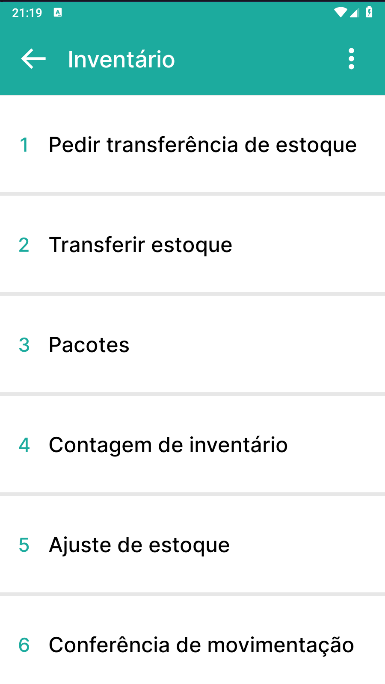

Inventário
^^^^^^^^^^^^

.. raw:: html

   

     
   

| \

Neste tópico exibiremos os processos realizados nos menus Pedir transferência de estoque, Transferir estoque, Pacotes, Contagem de inventário e Ajuste de estoque

| \

**Sumário**

.. toctree::
   :maxdepth: 30

   PedirTransfEstoque/PedirTransfEstoque
   TransferirEstoque/TransferirEstoque
   Pacotes/Pacotes
   ContagemInventário/ContagemInventário
   AjusteEstoque/AjusteEstoque
   ConferenciaDeMovimentação/ConferenciaDeMovimentação

| \