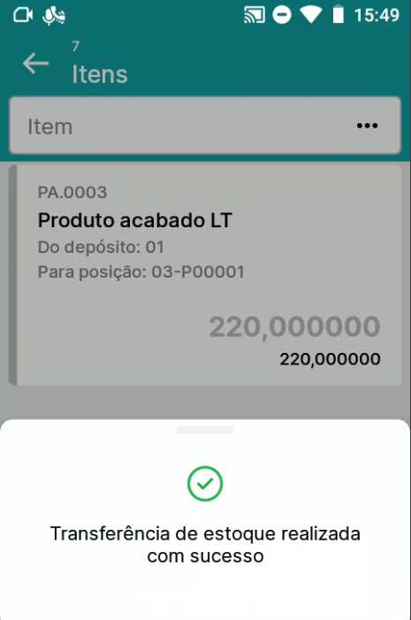
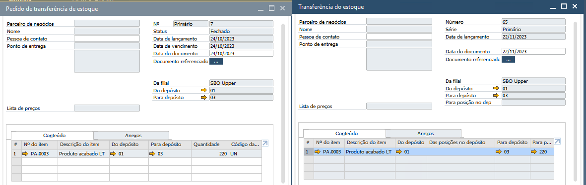
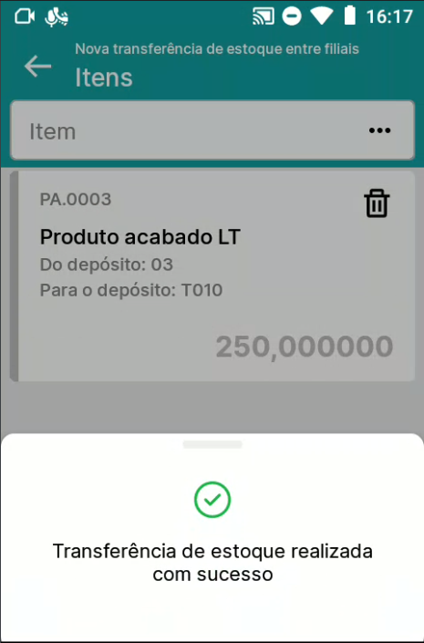

Transferir estoque
^^^^^^^^^^^^^^^^^^^^

.. |image-link| image:: WMS-AcessandoTransferirEstoque.gif
   :width: 300px
   :align: middle

.. raw:: html

   

     
   

| \

Acessando o menu Transferir estoque, serão listados todos os pedidos de transferências criados. Selecione o pedido de transferência manualmente via tela ou via leitura de códigos de barras do número do documento.

| \

.. |image-link2| image:: WMS-AcessandopedidoTransf.gif
   :width: 300px
   :align: middle

.. raw:: html

   

     
   

| \

Selecionando o pedido de transferência, serão listados os itens definidos no documento. Prossiga escolhendo o item, informe a quantidade, e caso o depósito seja controlado por posições, informe a posição de destino.

| \

.. raw:: html

   

     
   

| \

| \

Concluindo o pedido de transferência no aplicativo, o documento Pedido de transferência de estoque no SAP será copiado para uma Transferência de estoque, realizando a movimentação no estoque.

| \

.. |image-link4| image:: WMS-OpçõesTransfEstoque.gif
   :width: 300px
   :align: middle

.. raw:: html

   

     
   

| \

No canto inferior direito, clicando no botão **+**, será possível selecionar 3 opções de transferência de estoque. **Nova transferência**, uma transferência de estoque comum. **Nova transferência por embalagem**, possível apenas para itens controlado por lote. **Transferência entre filiais**, inicia através do aplicativo, o processo de transferência entre filiais.

| \

.. tip::

   Saiba mais sobre o processo de Transferência entre filiais clicando **aqui**.

| \

Nova transferência
------------------

| \

.. |image-link5| image:: WMS-NovaTransf.gif
   :width: 300px
   :align: middle

.. raw:: html

   

     
   

| \

Selecionando a opção **Nova transferência**, será aberta a tela inicial da transferência de estoque, neste momento a lista de itens selecionados estará vazia. Escolha um item via leitura de código de barras do código do item ou selecionado através da lista de itens. Na tela seguinte, escolha o lote/série ou a localização. Preencha a quantidade de transferência e informe o depósito/posição de destino.

| \

.. tip::

   No momento de preencher a quantidade de transferência, o preenchimento de depósito/posição de destino pode ser feito automaticamente, desde que as configurações de Sugestão de destino estejam vigentes. Saiba mais sobre a Sugestão de destino clicando **aqui**.

| \

.. |image-link6| image:: WMS-ConcluindoNovaTransf.png
   :width: 300px
   :align: middle

.. raw:: html

   

     
   

| \

.. image:: WMS-DocSAPNovaTransf.png
   :align: center

| \

Concluindo a transferência de estoque no aplicativo, será gerado no SAP o documento Transferência de estoque, realizando a movimentação entre os depósitos.

| \

Nova transferência por embalagem
---------------------------------

| \

.. image:: WMS-ConfNovaTransfEmb.png
   :align: center

| \

Antes de iniciar o processo de transferência por embalagem, certifique-se que no Cadastro do item, na aba Venda, o campo Quantidade por embalagem esteja preenchido.

| \

.. |image-link7| image:: WMS-NovaTransfEmb.gif
   :width: 300px
   :align: middle

.. raw:: html

   

     
   

| \

Selecionando a opção **Nova transferência por embalagem**, será aberta a tela inicial da transferência de estoque, neste momento a lista de itens selecionados estará vazia. Escolha um item via leitura de código de barras do código do item ou selecionado através da lista de itens. Na tela seguinte, escolha o lote/série ou a localização. Será aberto um modal, para informar a quantidade de embalagens a serem transferidas. Após informar a quantidade de embalagens, nos detalhes do item, realize a leitura via código de barras do código do lote, até que seja atingido o total máximo de embalagens, neste exemplo 5/5. Por fim, defina o depósito/posição de destino e registre.

| \

.. |image-link8| image:: WMS-ConcluindoNovaTransfEmb.png
   :width: 300px
   :align: middle

.. raw:: html

   

     
   

| \

.. image:: WMS-DocSAPNovaTransfEmb.png
   :align: center

| \

Concluindo a transferência de estoque por embalagem no aplicativo, será gerado no SAP o documento Transferência de estoque, realizando a movimentação entre os depósitos.

| \

Transferência entre filiais
----------------------------

| \

.. |image-link9| image:: WMS-TransfFiliais.gif
   :width: 300px
   :align: middle

.. raw:: html

   

     
   

| \

Selecionando a opção **Transferência entre filiais**, exibirá os clientes filiais para iniciar o processo de transferência. Na sequência, será aberta a tela inicial da transferência de estoque, neste momento a lista de itens selecionados estará vazia. Escolha um item via leitura de código de barras do código do item ou selecionado através da lista de itens. Nos detalhes do item, informe a quantidade e registre.

| \

.. raw:: html

   

     
   

| \

.. image:: WMS-DocSAPTransfFiliais.png
   :align: center

| \

Concluindo a transferência entre filiais no aplicativo, será gerado no SAP o documento Transferência de estoque e o esboço de Nota Fiscal de Saída.
