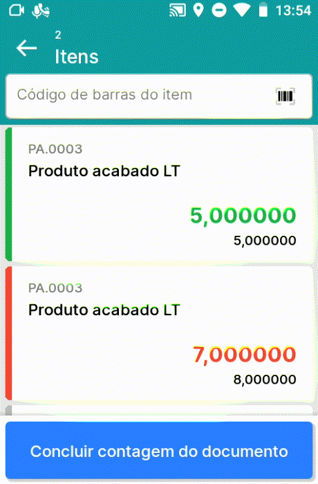
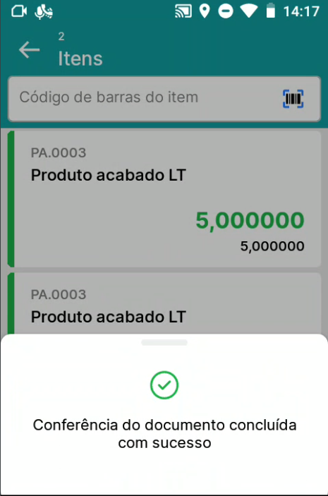

Conferência
^^^^^^^^^^^^^^^

.. |image-link| image:: WMS-AcessoMenuConferência.gif
   :width: 300px
   :align: middle

.. raw:: html

   

     
   

| \

Ao acessar o menu Conferência, todos os documentos criados no SAP serão listados. Os documentos que serão listados: Pedido de compra, Pedido de devolução, Esboço de Recebimento de mercadorias, N.F. Nacionalização e Nota fiscal de transporte.

| \

.. tip::

   Os documentos de N.F. Nacionalização e Nota Fiscal de Transporte fazem parte do BR One Importação. Saiba mais sobre esses documentos clicando aqui.

| \

.. |image-link2| image:: WMS-AcessandoDocRecebimento.gif
   :width: 300px
   :align: middle

.. raw:: html

   

     
   

| \

Você pode acessar os documentos listados selecionando manualmente, realizando a leitura via código de barras da chave de acesso ou utilizando no canto superior direito os filtros de busca.

| \

.. important::

   A leitura da chave de acesso do documento ocorrerá apenas para documentos que possuam a chave de acesso definida previamente.

| \

.. |image-link3| image:: WMS-SeleçãodeitemRecebimento.gif
   :width: 300px
   :align: middle

.. raw:: html

   

     
   

| \

Após acessar o documento, os itens serão listados. Selecione o item manualmente ou bipando o código do item/código de barras.

| \

.. important::

   Para bipar o código de barras, defina previamente o código de barras no Cadastro do item.

| \

.. |image-link4| image:: WMS-ApontamentoRecebimento.gif
   :width: 300px
   :align: middle

.. raw:: html

   

     
   

| \

Nos detalhes do item, preencha o lote/série, quantidade, depósito/posição e a data de vencimento para o lote/série. Registando o apontamento, será possível através do canto superior direito, acessar o histórico de lançamentos, para excluir ou editar os lançamentos. Retornando para a tela inicial do documento, será exibida a quantidade registrada.

| \

.. raw:: html

   

     
   

| \

No momento de finalizar a conferência do documento, se houver discordância nos registros, o usuário receberá um alerta e terá a opção de escolher entre 'Concluir' ou 'Recontar'. Optando por 'Concluir', a revisão do documento será encerrada, mesmo com a divergência. Se selecionar 'Recontar', as quantidades registradas serão redefinidas, permitindo uma nova revisão completa do documento.

| \

.. raw:: html

   

     
   

| \

Concluindo a conferência do documento, será gerado no SAP o documento de destino de acordo com o documento de origem:

- Pedido de compra → Recebimento de mercadorias

- Esboço de Recebimento de mercadorias → Recebimento de mercadorias

- Pedido de devolução → Devolução (Caso o Pedido de devolução possua vínculo com uma Nota Fiscal de Saída, será gerado Dev.Nota Fiscal de Saída)

| \

.. note::

   Configurações do WMS quando ativas, podem adicionar comportamentos no menu Conferência, clique **aqui** e saiba mais sobre as configurações.