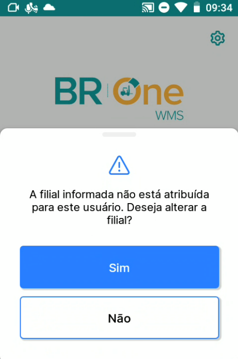

Configurações iniciais
^^^^^^^^^^^^^^^^^^^^^^

Para que seja possível realizar o primeiro acesso no aplicativo, serão necessárias algumas configurações iniciais.

Configuração de servidor
~~~~~~~~~~~~~~~~~~~~~~~~~~~~~~~~~~~~~~~~~~~~~~~~~~~~~~~~
| \

.. |image-link| image:: WMS-BotãoConfiguraçãoServidor.png
   :width: 300px
   :align: middle

.. raw:: html

   

     
   

| \

Ao abrir o aplicativo, no canto superior direito, existe um ícone de engrenagem, ao clica-lo, tem-se acesso a tela de configuração de servidor.

| \

.. |image-link2| image:: WMS-TelaConfigurações.gif
   :width: 300px
   :align: middle

.. raw:: html

   

     
   

| \

A tela de configuração é composta pelos seguintes campos: 
	• **Servidor**: Endereço IPV4 do servidor onde o API do WMS foi configurado. 
	• **Porta**: Porta logica onde o API do WMS foi configurado via **IIS**.
	• **Base de dados**: Nome da base SAP onde as transações serão realizadas.
	• **Filial padrão**: Código  da filial onde as transações serão realizadas.

| \

.. |image-link3| image:: WMS-TelaConfiguraçõesConcluida.gif
   :width: 300px
   :align: middle

.. raw:: html

   

     
   

| \

Ao inserir todos os dados e testar a conexão, clique em Salvar para que a configuração seja utilizada no momento em que o usuário acessar o aplicativo.

Cadastro de usuário no WMS
~~~~~~~~~~~~~~~~~~~~~~~~~~~~~~~~~~~~~~~~~~~~~~~~~~~~~~~~

.. image:: WMS-ColaboradorCadastrado.png
   :align: center

| \

Para criar um usuário no WMS, é necessário que  no SAP o Cadastro de usuário esteja vinculado a um Cadastro do colaborador.
Esse vínculo pode ser feito no SAP através do menu **Cadastro de colaboradores**, no campo **Código do usuário**. 

| \

Para criar uma senha, basta preencher o campo **Senha BR One WMS** com a senha desejada.

| \

Ao finalizar o cadastro de usuário WMS, é importante definir as `autorizações de utilização <https://brone.help.uppertools.com.br/BROne/html/BROneWMS/Configura%C3%A7%C3%B5esAdicionais/Autoriza%C3%A7%C3%B5esUsu%C3%A1rios/Autoriza%C3%A7%C3%B5esUsu%C3%A1rios.html>`_ do mesmo.

Configuração de Armazéns 
~~~~~~~~~~~~~~~~~~~~~~~~~~~~~~~~~~~~~~~~~~~~~~~~~~~~~~~~

| \

No SAP Business One, em **Módulos > Administração > Definição > BR One WMS > Cadastro do armazém**, crie o(s) armazém(ens) vinculado(s) a filial desejada.

| \

.. |image-link4| image:: WMS-nãoexistearmazémconfigurado.gif
   :width: 300px
   :align: middle

.. raw:: html

   

     
   

| \

Não existindo um **Cadastro do Armazém** vinculado a filial, na tentiva de realizar o login será exibida a mensagem do GIF a cima.

| \

| \

.. raw:: html

   

     
   

| \

Certifique-se que, após a criação dos Armazéns, os usuários estejam vinculados a pelo menos uma filial, caso contrário, será exibida a mensagem a cima, solicitando a alteraração da filial de acesso.

| \

| \

No SAP Business One, em **Módulos > Administração > Definição > BR One WMS > Configurações WMS**, defina nas abas **Geral**, **Recebimento** e **Expedição**, pelo menos um usuário para o recebimento de mensagens/alertas.

| \

.. image:: WMS-ExemploDeAlertaMensagem.gif
   :align: center

| \

Uma vez definidos os usuários para o recebimento das mensagens/alertas, serão exibidas para os usuários diretamente na **Visão geral de mensagens/alertas**.

| \

.. image:: WMS-MotivosdeAjuste.png
   :align: center

| \

No SAP Business One, em **Módulos > Administração > Definição > BR One WMS > Cadastro de motivo de ajuste**, defina as contas contábeis que serão utilizadas no processo de Ajuste de estoque.